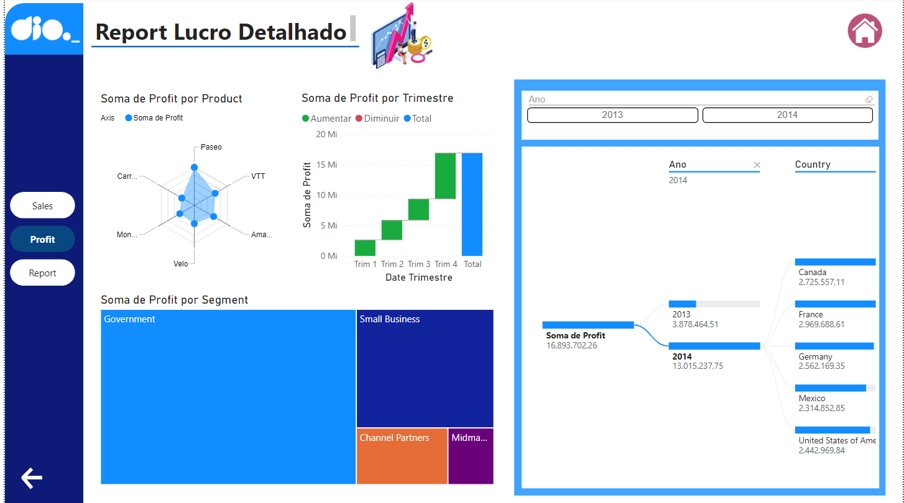

# Criando um Dashboard Gerencial para Tomada de Decisões Com Power BI

## Objetivo

O objetivo deste projeto é desenvolver um [Dashboard Gerencial de Vendas](SalesReport_DesafioDio.pbix) utilizando o Power BI, visando auxiliar a tomada de decisões estratégicas para a equipe de gestão. O dashboard deve proporcionar uma visão clara e objetiva dos principais indicadores de desempenho de vendas, como faturamento, volume de vendas, desempenho por região e vendedor, além de possibilitar uma análise dinâmica dos dados com foco na experiência do usuário. A meta é oferecer uma ferramenta que otimize a análise dos dados de vendas e facilite a identificação de tendências e oportunidades.

## Desenvolvimento

Para a criação do dashboard, o desenvolvimento foi centrado na construção de visualizações interativas e intuitivas, utilizando as funcionalidades avançadas do Power BI. Inicialmente, foi feita a integração dos dados de vendas, organizando-os de forma estruturada para alimentar as visualizações. Em seguida, foram definidos os KPIs (Key Performance Indicators) mais relevantes para a gestão, como faturamento total, número de vendas, margem de lucro, ticket médio, entre outros.

Com base nesses dados, foram criadas visualizações dinâmicas que permitem a segmentação por período, região e vendedor, facilitando a análise detalhada de cada aspecto das vendas. O design do dashboard seguiu princípios de UX (User Experience) e UI (User Interface), focando na disposição clara das informações e na aplicação de contraste para destacar os dados mais importantes. Também foram inseridos filtros interativos e botões de navegabilidade para melhorar a experiência do usuário, permitindo uma análise fluida e personalizada conforme as necessidades da gestão.

A criação de gráficos de barras, linhas e mapas de calor ajudou a representar visualmente as variações de desempenho ao longo do tempo e por localização geográfica. Além disso, a flexibilidade do Power BI foi explorada com o intuito de criar relatórios personalizados com base nas preferências dos usuários finais.

## Conclusão

O [Dashboard Gerencial de Vendas](SalesReport_DesafioDio.pbix) desenvolvido no Power BI atendeu plenamente aos objetivos do projeto, oferecendo à equipe de gestão uma ferramenta poderosa para a tomada de decisões estratégicas. A integração de visualizações dinâmicas e interativas proporcionou uma análise clara e detalhada dos principais indicadores de vendas, permitindo que os gestores identifiquem rapidamente áreas de melhoria e oportunidades de crescimento. O foco na experiência do usuário resultou em um dashboard intuitivo e eficaz, que pode ser facilmente adaptado às necessidades específicas do negócio.

